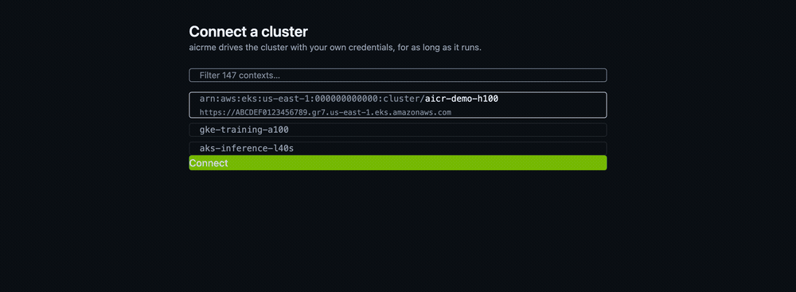

# aicrme
AI Cluster Runtime Configurer

A single binary that turns a vanilla GPU cluster into a working AI platform through a browser
console: it discovers the cluster, recommends a validated
[AICR](https://github.com/NVIDIA/aicr) recipe, installs it while streaming live cluster telemetry,
validates what it installed, and then runs a reference workload that proves the cluster works.

It runs on your machine, not in the cluster. You pick a context from your own kubeconfig, and it
drives the cluster from there.



> An independent, MIT-licensed project built on AICR. Not an NVIDIA product and not affiliated
> with or endorsed by NVIDIA.

## How this relates to AICR

[NVIDIA AI Cluster Runtime](https://github.com/NVIDIA/aicr) is the substance. It captures
known-good combinations of drivers, operators, kernels and system configuration as version-locked
**recipes**, resolves the right one for a given cluster, renders it into a deployable bundle,
validates the result, and signs evidence of what it found. aicrme carries the AICR Go SDK as a
pinned dependency (`v0.20.0`) and calls it directly — no CLI shell-out, no reimplementation of
recipe logic. Every recipe decision, every component version, and every validation verdict comes
from AICR.

What aicrme adds is the **operator experience of running that arc once, on one cluster, and seeing
what happened.**

| Gap | What aicrme does about it |
|---|---|
| The arc is a sequence of CLI steps — snapshot, resolve, bundle, deploy, validate — each with its own flags, in an order you have to know | One browser flow with no command options. You choose a kubeconfig context and make one decision: approve the recipe or don't |
| A bundle install is ten to twenty minutes of mostly-silent `helm`, dominated by a driver compile | A live cockpit: per-component conditions, cluster events scoped to the run, and pod state as it changes |
| A snapshot is an input to recipe resolution, not an answer to "is this cluster usable" | A gap report before anything is installed — *N of M GPUs usable today*, what is missing, and which component would supply it |
| Installing succeeded, but nothing has run on the cluster | A reference workload: a gang-scheduled job placed by kai-scheduler, one pod per GPU, held running until you stop it |
| Bundles install; taking them back out is left to you and `helm` | Reset — uninstalls every release the run created, plus the objects charts tell helm to keep, and reports what it could not remove rather than pretending |
| A process that dies mid-install leaves a cluster in an unknown state | The run is persisted and recovered on restart, reconciled against what is actually in the cluster |

aicrme does not fork, patch, or work around AICR's recipe content. Where it finds a genuine gap in
the SDK, that goes upstream as an issue on
[NVIDIA/aicr](https://github.com/NVIDIA/aicr/issues) rather than being carried here.

## Install

Homebrew, on macOS or Linux:

```sh
brew install mchmarny/tap/aicrme
```

Or the install script, which verifies the download's checksum and — when `gh` is
present — its build provenance, before installing:

```sh
curl -fsSL https://raw.githubusercontent.com/mchmarny/aicrme/main/scripts/install.sh | bash
```

Or from source:

```sh
make build
./bin/aicrme
```

Every release archive is published with a `checksums.txt` and a SLSA build provenance
attestation tied to the workflow run that produced it. To check one yourself:

```sh
gh attestation verify aicrme_<version>_<os>_<arch>.tar.gz --repo mchmarny/aicrme
```

Then run it:

```sh
aicrme
```

It binds a loopback address, prints a tokenized URL, and opens your browser at it.

Flags: `--addr` (default `127.0.0.1:0`; a non-loopback address is refused rather than warned
about), `--kubeconfig`, `--context`, `--work-dir` (default `~/.aicrme`, or `AICRME_WORK_DIR`), and
`--open=false` to skip the browser.

## Using it

The console walks one run from end to end. Each phase is a screen.

1. **Connect** — pick a context from your kubeconfig. aicrme flattens it into a per-launch file so
   a `kubectl config use-context` elsewhere cannot redirect a running install.
2. **Discover** — AICR's snapshot agent inspects the cluster. You get the gap report: how many
   GPUs are usable today, and what stands between you and the rest.
3. **Recommend** — AICR resolves a recipe for what it found. The console shows the components and
   versions it would install.
4. **Confirm** — the one decision. Nothing has touched the cluster before this point.
5. **Apply** — the bundle installs, component by component, with the cockpit live.
6. **Validate** — AICR's `deployment` validation phase runs against what was just installed and
   records a verdict. On a simulated cluster it skips and says why rather than reporting a pass it
   cannot stand behind.
7. **Prove** — the reference workload is submitted and placed. The run ends *active*, with the
   workload deliberately left running.
8. **Stop**, then optionally **Reset** — Stop removes the workload. Reset takes the whole install
   back out. Neither is automatic.

### Requirements

`bash`, `helm` and `kubectl` must be on your PATH; `jq` is used when present. All are checked at
startup, before anything touches a cluster, and the resolved versions are recorded on every run
and shipped in its evidence bundle.

Direct internet access to `ghcr.io`, `nvcr.io`, and the upstream Helm repositories is an assumed
precondition. Air-gapped clusters are not supported.

## Security

**This console acts with your cluster credentials, and it is a demo and eval tool only.**

- It has exactly what your kubeconfig has. That needs no justification because it is not a grant:
  nothing is created in the cluster to give this console permission. It cannot be narrowed either
  — the console installs gpu-operator, cert-manager, DRA drivers, CRDs, and privileged
  DaemonSets, and creates namespaces, so in practice it wants what a cluster admin has.
- It holds those credentials for as long as it runs. The selected context is flattened into a
  per-launch file under the work directory so a `kubectl config use-context` mid-install cannot
  redirect it — which means a bearer token or client key in that context is inlined on disk until
  the process exits, and deleted when it does. An exec-based context (`gke-gcloud-auth-plugin`,
  `aws eks get-token`) flattens to the stanza rather than a secret, and is the benign case.
- AICR's snapshot agent runs privileged pods on GPU nodes in order to read `nvidia-smi` and PCIe
  topology. This is existing AICR behavior, not new exposure, but it is part of the same
  disclosure.
- Validation creates a namespace, a ServiceAccount and a cluster-admin ClusterRoleBinding for the
  duration of the run. AICR removes the RBAC on its own; the namespace is left behind and Reset
  does not own it.
- The HTTP surface is loopback-only and authenticated by a launch token printed in the URL,
  exchanged once for a process-lifetime session cookie. There is no password, no user management,
  and no OIDC. The session dies with the process.
- Do not point it at a production cluster. Use disposable demo and eval clusters.

## Development

```sh
make qualify   # full local gate: SPA build, lint, tests with coverage floor, AICR pin check
make help      # all targets
```

**[docs/STATE.md](docs/STATE.md)** is where to start: what is proven, on what hardware, what is
left, and how to run each verification. It is the only status document, written in present tense
and edited rather than appended to.

## License

MIT. See [LICENSE](LICENSE).
